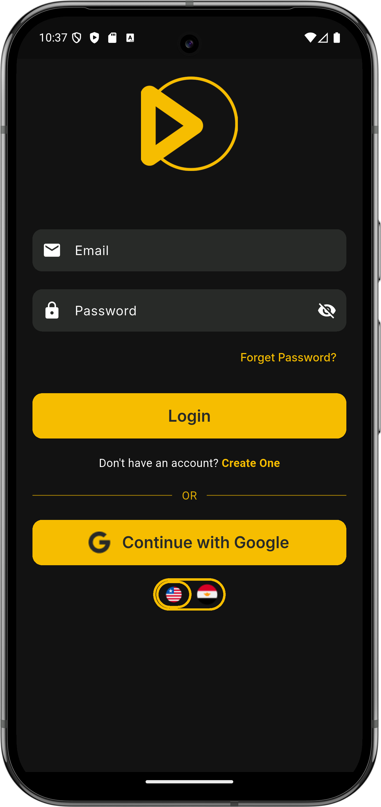
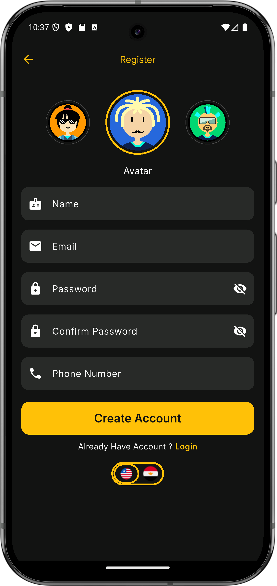
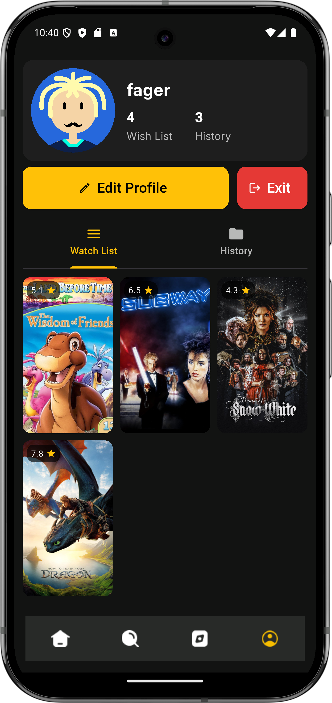
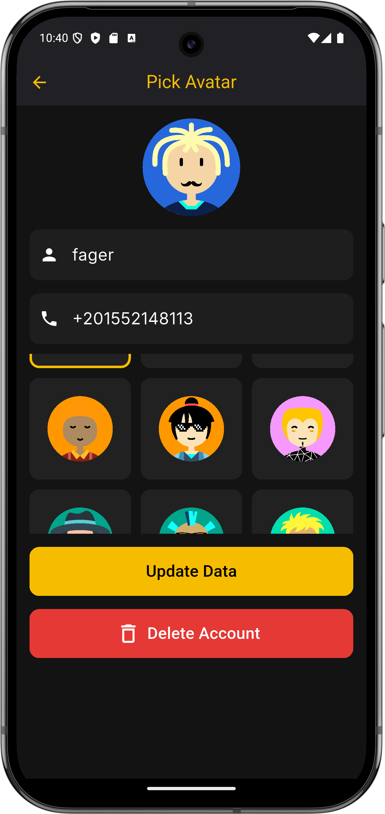

<p align="center">
  
</p>

# 🎬 Movie App (Flutter)

A modern **Movie Discovery App** built with **Flutter**.  
Users can register/login (email + Google via **Firebase**), explore movies from the [YTS API](https://yts.mx/api), save **Wish List** & **History** locally using **Hive**, and manage their profile with **random avatars**.

---

## 📸 Screenshots

| Login | Register | Introduc | Home | Search | Libirary | Profile | Update |
|--------|----------|----------|------|---------|----------|---------|--------|
|  |  |  |  |  |  |  |  |

---

## 🎥 Demo

[[Watch the demo]](https://github.com/fagerhu03/movie_app/blob/master/assets/screenshot/movie_app_demo.mkv)

---

## 🚀 Features

- 🔐 **Authentication**
  - Email & Password (via backend API)
  - Google Sign-In (**Firebase Auth**)
  - Password reset (API + Firebase email)
- 👤 **Profile**
  - Update name, phone, avatar (with **random_avatar** package)
  - Delete account (API)
  - Persist profile data locally with **Hive**
- 🎥 **Movies**
  - Browse movies from [YTS API](https://yts.mx/api)
  - Movie details: screenshots, cast, genres, torrents
  - Play trailers with `youtube_player_flutter`
- ⭐ **Lists**
  - Wish List & History stored locally in **Hive**
  - Auto-sync with remote API when available
- 🖼️ **UI/UX**
  - Custom **Splash Screen** (`flutter_native_splash`)
  - Custom **Launcher Icon** (`flutter_launcher_icons`)
  - Dark theme with yellow accent
  - Responsive UI (`flutter_screenutil`)
- 🌍 **Localization**
  - Language switcher (EN 🇺🇸 / AR 🇪🇬 toggle)

---

## 🛠️ Tech Stack

- **Framework**: Flutter (Dart)
- **Auth**: Firebase Auth + Google Sign-In
- **Local DB**: Hive
- **Avatar**: random_avatar
- **Networking**: Dio
- **Media**: youtube_player_flutter
- **UI Utilities**: flutter_screenutil, carousel_slider
- **Splash & Icons**: flutter_native_splash, flutter_launcher_icons

---

## 📂 Project Structure

```plaintext
lib/
├── core/
│   ├── env.dart
│   ├── theme/            # Theme color for the app 
│
├── data/
│   ├── avatar_seeds.dart
│   ├── local/            # Hive local DB
│   ├── models/           # User, Auth, ListEntry, Movies
│   ├── api/          
│   └── network/
│
├── domain/
│   └── services/         # AuthApiService, ProfileApiService, YtsApiService
│
├── screens/
│   ├── auth_screen/      # Login, Register, Forgot Password
│   ├── home_screen/      # Tabs: Home, Search, Library, Profile
│   ├── movie_details/    # MovieDetailsScreen
│   ├── intro_screen/     # Introduction screen with onboarding
│   └── profile/          # UpdateProfileScreen
│
└── main.dart             # App entrypoint
└── firebase_options.dart
└── bootstrap.dart                  
```

---

## 🌐 APIs Used

- 🔹 **Auth API** (custom backend)  
  - `POST /auth/register`  
  - `POST /auth/login`  
  - `GET /profile`  
  - `PATCH /profile`  
  - `DELETE /profile`  


- 🔹 **Movies API** – [YTS.mx API](https://yts.mx/api)  
  - `GET /list_movies.json`  
  - `GET /movie_details.json`  
  - `GET /movie_suggestions.json`

---


## ⚙️ Installation

1. **Clone the repo**
   ```bash
   git clone https://github.com/your-username/movie_app.git
   cd movie_app
   ```

2. **Install dependencies**
   ```bash
   flutter pub get
   ```

3. **Setup Firebase**
   - Add app in Firebase Console with your package name (`applicationId` in `android/app/build.gradle`)
   - Download `google-services.json` → put in `android/app/`
   - Add SHA-1 & SHA-256 fingerprints
   - Enable **Google Sign-In** in Firebase Auth

4. **Generate Splash & Launcher icons**
   ```bash
   flutter pub run flutter_native_splash:create
   flutter pub run flutter_launcher_icons:main
   ```

5. **Run the app**
   ```bash
   flutter run
   ```

---

## 📌 Dependencies

```yaml
dependencies:
  flutter:
    sdk: flutter
  flutter_screenutil: ^5.9.3
  carousel_slider: ^5.1.1
  random_avatar: ^0.0.8
  flutter_svg: ^2.0.10+1
  provider: ^6.1.5
  firebase_core: ^3.15.2
  cloud_firestore: ^5.6.12
  firebase_auth: ^5.7.0
  google_sign_in: ^6.2.1
  dio: ^5.5.0
  flutter_secure_storage: ^9.2.2
  equatable: ^2.0.5
  shared_preferences: ^2.2.2
  url_launcher: ^6.3.0
  youtube_player_flutter: ^9.0.1
  hive: ^2.2.3
  hive_flutter: ^1.1.0
  flutter_native_splash: ^2.4.6
  cupertino_icons: ^1.0.8

```
## 🙏 Acknowledgements

Special thanks to Route team for providing the learning opportunity.

---

## 📬 Contact

**Fager Hussein Ahmed**  
📧 fagerhu03@gmail.com  
🔗 [LinkedIn](https://www.linkedin.com/in/fagerhu/)  
💻 [GitHub](https://github.com/fagerhu03)


## 🔗 Links

- 🎬 [YTS Movies API](https://yts.mx/api)  
- 🔑 [Firebase Authentication](https://firebase.google.com/docs/auth)  
- 🐝 [Hive Database](https://docs.hivedb.dev/#/)  
- 🎨 [flutter_launcher_icons](https://pub.dev/packages/flutter_launcher_icons)  
- 🖼️ [flutter_native_splash](https://pub.dev/packages/flutter_native_splash)

---

💡 Built with ❤️ using Flutter
